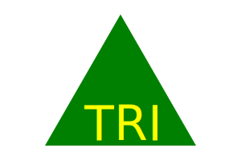

# super-vector-generator

 

## Description
Super Vector Generator(SVG) is a SVG LOGO Generator is a NODE.js CLI that will create a .svg logo from provided prompts and responses.

## Table of Contents
- [Description](#description)
- [Installation](#installation)
- [Usage](#usage)
- [Preview](#preview)
- [License](#license)
- [Questions](#questions)

## Installation
`npm i super-vector-generator`

## Usage
- If `super-vector-generator` is in the root directory of your project type `npm start` into the terminal and then follow the prompts to create a LOGO.
- If `super-vector-generator` is in your `node_modules` folder from npm install type: `node node_modules/super-vector-generator/index.js` and follow the prompts from there.

## Preview
[YouTube Link](https://youtube.com)

## License
[MIT](http://choosealicense.com/licenses/mit/)

A short and simple permissive license with conditions only requiring preservation of copyright and license notices. Licensed works, modifications, and larger works may be distributed under different terms and without source code.

## Questions

**If you have any questions feel free to use the links below:**

GitHub Profile: https://github.com/shindekokoro

Email: brian.whisler@gmail.com
