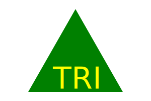
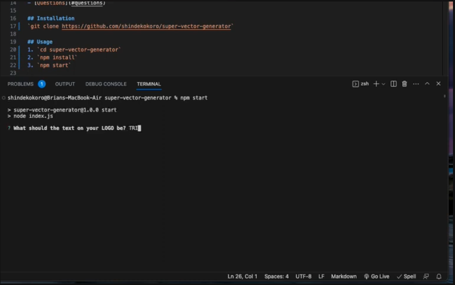

# super-vector-generator

 

## Description
Super Vector Generator(SVG) is a SVG LOGO Generator is a NODE.js CLI that will create a .svg logo from provided prompts and responses.

## Table of Contents
- [Description](#description)
- [Installation](#installation)
- [Usage](#usage)
- [Preview](#preview)
- [License](#license)
- [Questions](#questions)

## Installation
`git clone https://github.com/shindekokoro/super-vector-generator`

## Usage
1. `cd super-vector-generator`
2. `npm install`
3. `npm start`

## Preview
[YouTube Link](https://youtu.be/aYiW-hqJolg)

## License
[MIT](http://choosealicense.com/licenses/mit/)

A short and simple permissive license with conditions only requiring preservation of copyright and license notices. Licensed works, modifications, and larger works may be distributed under different terms and without source code.

## Questions

**If you have any questions feel free to use the links below:**

GitHub Profile: https://github.com/shindekokoro

Email: brian.whisler@gmail.com
